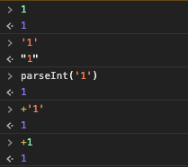

parseInt 의 약어가 존재한다는 것을 알아내게 되는 일이 있었다.  
```parseInt(1) ``` 은 ``` +'1' ``` 과 동일하다는 것이다.  
이 이유에 대해서는 자세히 알지는 못해서 이래저래 알아보고 동료직원과 고민도 해봤는데,  
뚜렷한 근거에 대해서는 알지 못했다.  

이 글을 보고 _으잉?_ 하는 사람들도 있을 것 같아서 아래 사진을 첨부해본다.  
~~나만 몰랐던 거 아니라고 해주세요~~



그런데 ```+1``` 표현을 처음 봐서, 익숙치 않아서 그럴진 몰라도 가독성이 그리 좋아보이진 않아서  
실무나 프로젝트에 쓸 것 같지는 않다...

혹시 이에 대해서 이유/원인을 알고 있는 천사같은 분이 있으시다면,  
귀찮음을 무릎써주실 수 있다면,  
**den.shin.dev@gmail.com** 으로 알려주시면 너무 감사하는 마음으로 살겠습니다-
